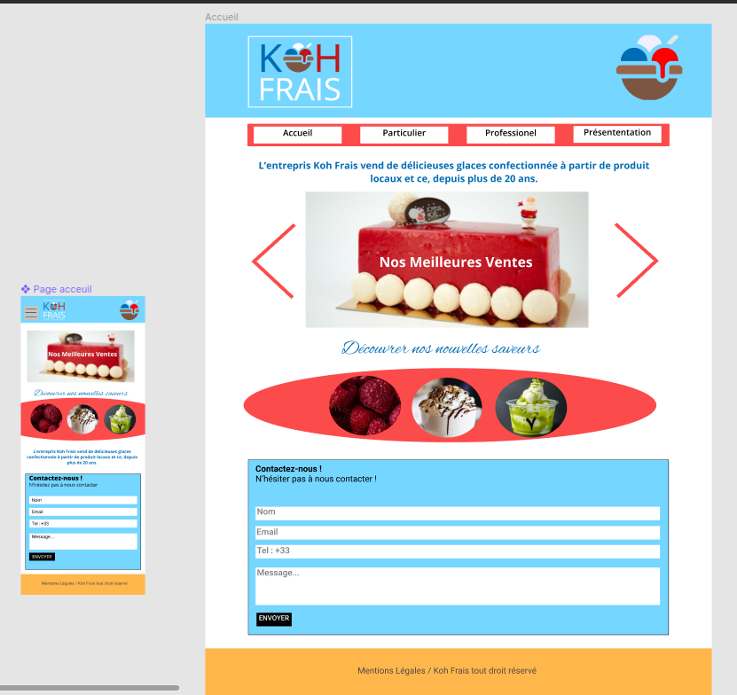
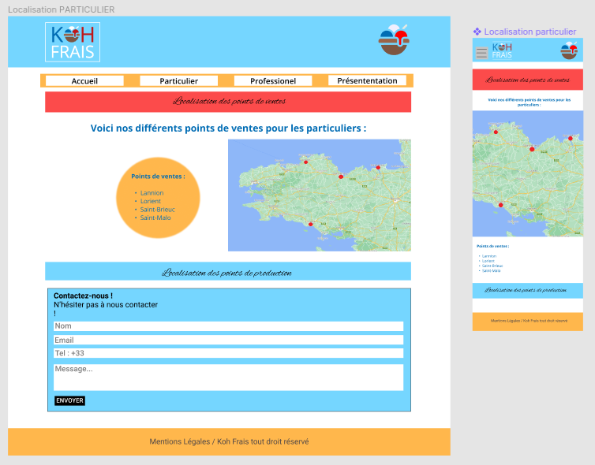

# Site web Koh Frais 

**Lien du site** : ....

Notre travail consistait à réaliser un site web pour le besoin d'un client. Ce site web avait pour but d'être un site vitrine pour présenter les différents articles que le client vend, ici des glaces. 

## Les différentes étapes 

Pour cela, nous avons réalisé plusieurs étapes successifs:

- Tout d'abord, la réalisation d'une expressions des besoins du client. **ExpressionDesBesoins_GroupeF11**
- Puis, la réalisation du contenu du site web (les pages et leurs contenus). **Contenu_page**
- Ensuite, la réalisation de l'arborescence du site web. **Arborescence.pdf** 
- Puis, la réalisation de la charte graphique du site web. **Charte_graphique.pdf**
- Après cela, la réalisation de la maquette du site web à l'aide de Figma. Voici des exemples : 
  
- Ensuite, la réalisation du diaporama pour la soutenance du site web. **SAE_1.05.pdf** 
- Enfin, la conception et la réalisation du site web. 
